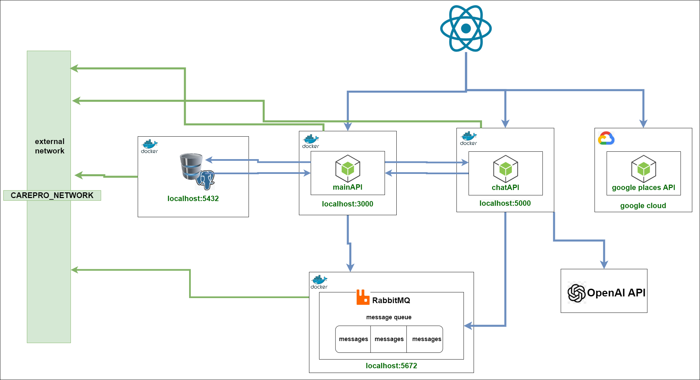
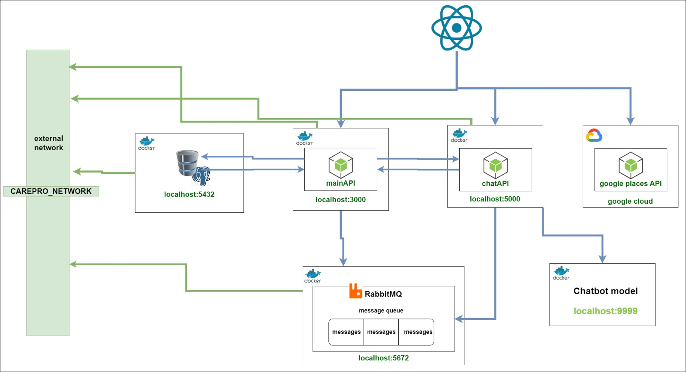
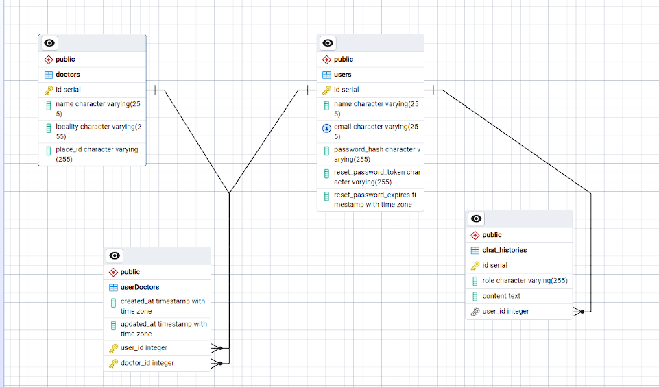

## carePro project

# A PROFESSIONAL HEALTHCARE ASSISTANT AT YOUR SERVICE


## Project Architecture

#### Using OpenAI


#### Using our own chatbot


#### Database



## Prerequisites 
- Docker
- Node

## Running the application

#### step 1 - main api

- Installing dependencies
 
```bash
cd api
npm install
```

- Next, you need to set up `.env` file
```python
SECRET="" # for JWT (Json web token)
# For database
DATABASE_URL=""
DB_USER="postgres"
POSTGRES_PASSWORD=""
DB_HOST="localhost"
DB_PORT="5432"
DB_NAME="carepro"
# node server port
PORT="3000"
```

- Finally, build the docker image and run the container.
```bash
docker compose up --build
```

### step 2 - chatbot

Here you have a choice between using OpenAI Api, or a custom chatbot.

##### OpenAI API

```bash
cd chatApi
```

- set up `.env`

```python
OPENAI_API_KEY = ""
```

- Build the image and run the container

```bash
docker compose up --build
```

#### Using our custom chatbot

```bash
cd careproChatBot/app
docker compose up --build # this may take a while
```
```bash
cd ../../chatApi2
docker compose up --build
```

## step 3 - front end

- Install dependencies
```bash
cd client
npm install
```

- Run the server

```bash
npm run dev
```

Project made with love.

For the chatbot implementation details, refer to `./how` folder